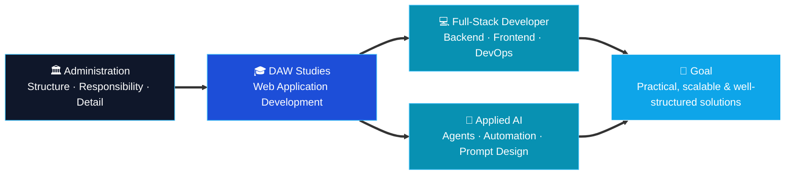

<div align="center">


<br/>

<p>
  
  
  
  
</p>

<p>
  <a href="https://github.com/EricKColl">
    
  </a>
  <a href="mailto:erickcollrodriguez@gmail.com">
    
  </a>
  
  
</p>

</div>


## 🧭 About Me

```yaml
name:        Erick Coll Rodríguez
role:        Web Application Development (DAW) Student
transition:  Administration ➜ Software Development
direction:   Full-Stack Development · Applied AI
mindset:     "Discipline builds consistency. Consistency builds skill. Skill builds value."
```

I am an ambitious and disciplined professional currently studying **Web Application Development (DAW)**, with a strong interest in **software development**, **modern web technologies**, and **applied artificial intelligence**.

Coming from the field of administration, I have developed a solid foundation in **organization**, **responsibility**, **problem-solving**, **attention to detail**, and **structured work** — skills that I now apply to my transition into the tech world.

I am currently building my knowledge in **programming**, **backend and frontend development**, **operating systems**, **virtualization**, **containerization**, and **real-world digital tools** through hands-on projects and continuous learning. I also work with technologies such as **C++**, **PHP**, **WordPress**, **Laravel**, **Docker**, **VirtualBox**, and **Hyper-V**.

My goal is to grow into a versatile developer capable of building **practical, scalable, and well-structured solutions**.

At the same time, I actively explore the practical use of AI in both **technical** and **creative** environments. I work with tools such as **Claude**, **ChatGPT**, **Codex**, **DeepSeek**, **Microsoft Copilot**, **Google Gemini**, **Suno AI**, and different **AI agents** to support coding workflows, research, prompt design, automation, content generation, digital productivity, and creative experimentation.


## 🗺️ My Journey




## 🎯 Core Profile

<table align="center" width="100%">
  <tr>
    <td><strong>🎓 Current path</strong></td>
    <td>Web Application Development (DAW)</td>
  </tr>
  <tr>
    <td><strong>💻 Main direction</strong></td>
    <td>Full-Stack Development</td>
  </tr>
  <tr>
    <td><strong>🧠 Extra focus</strong></td>
    <td>Applied AI, AI agents, productivity workflows, prompt design</td>
  </tr>
  <tr>
    <td><strong>🏗 Background</strong></td>
    <td>Administration and structured professional work</td>
  </tr>
  <tr>
    <td><strong>🚀 Goal</strong></td>
    <td>Build useful, scalable and well-designed digital solutions</td>
  </tr>
</table>


## 🛠 Tech Stack

<details open>
<summary><strong>⚡ Currently learning / using</strong></summary>
<br/>
<p align="center">
  
</p>
<p align="center">
  
  
  
  
  
  
  
  
  
  
</p>
</details>

<details open>
<summary><strong>🌱 Familiar with</strong></summary>
<br/>
<p align="center">
  
</p>
<p align="center">
  
  
  
  
  
</p>
</details>

<details open>
<summary><strong>🤖 AI interests & applied tools</strong></summary>
<br/>
<p align="center">
  
  
  
  
  
  
  
  
  
</p>
</details>

<details open>
<summary><strong>🧰 Tools & environments</strong></summary>
<br/>
<p align="center">
  
</p>
<p align="center">
  
  
  
  
  
  
  
  
  
  
</p>
</details>


## 🤖 AI & Digital Workflow Interests

| Area | Focus |
|:--|:--|
| ⚙️ **Applied AI** | Coding support, structured workflows, and productivity |
| 💬 **AI Assistants** | Claude, ChatGPT, Codex, DeepSeek, Gemini, and Copilot in learning and development processes |
| 🕹 **AI Agents** | Practical experimentation for automation, task support, reasoning workflows, and process optimization |
| 🖼 **Media Tools** | AI tools for photo editing, video editing, file and document processing |
| 🎵 **Creative Workflows** | AI-assisted music, content creation, and digital media workflows, including tools such as Suno AI |
| 🔁 **Continuous Exploration** | Automation, prompt design, and practical AI integration |


## 🎯 Current Goals

- [ ] Strengthen my **Java** and **backend development** foundations
- [ ] Build more complete and polished **full-stack projects**
- [ ] Improve my **GitHub portfolio**, code structure and project presentation
- [ ] Continue exploring **applied AI** in practical and productive workflows
- [ ] Grow as a disciplined developer with strong technical foundations

## 🧩 Soft Skills

<p align="center">
  
  
  
  
  
  
</p>


## 🚀 Featured Projects

<table>
  <tr>
    <td width="50%" valign="top">
      <h3 align="center">💼 <a href="https://github.com/EricKColl/FullStackAttack-Producto4">FullStackAttack · Producto 4</a></h3>
      <p align="center">
        <a href="https://github.com/EricKColl/FullStackAttack-Producto4">
          
        </a>
      </p>
      <p><strong>Full-Stack JavaScript application</strong> integrating frontend, GraphQL, MongoDB, Mongoose, Fetch and WebSockets — the most complete iteration of the JobConnect platform.</p>
      <p align="center">
        
        
        
        
      </p>
    </td>
    <td width="50%" valign="top">
      <h3 align="center">🔧 <a href="https://github.com/EricKColl/ReparaYa-Producto3-Laravel">ReparaYa · Laravel</a></h3>
      <p align="center">
        <a href="https://github.com/EricKColl/ReparaYa-Producto3-Laravel">
          
        </a>
      </p>
      <p><strong>Migration of the ReparaYa repair-management system to Laravel</strong>, with database integration and MVC architecture.</p>
      <p align="center">
        
        
        
        
      </p>
    </td>
  </tr>
  <tr>
    <td width="50%" valign="top">
      <h3 align="center">🛠 <a href="https://github.com/EricKColl/ReparaYa-Producto2">ReparaYa · PHP + Docker</a></h3>
      <p align="center">
        <a href="https://github.com/EricKColl/ReparaYa-Producto2">
          
        </a>
      </p>
      <p><strong>Repair-management web application</strong> built in framework-less PHP, with MVC architecture, MySQL and Docker.</p>
      <p align="center">
        
        
        
      </p>
    </td>
    <td width="50%" valign="top">
      <h3 align="center">🛒 <a href="https://github.com/EricKColl/BugBusters-Producto2">BugBusters · Producto 2</a></h3>
      <p align="center">
        <a href="https://github.com/EricKColl/BugBusters-Producto2">
          
        </a>
      </p>
      <p>Collaborative <strong>Java project</strong> focused on MVC architecture, generics, exceptions, JUnit testing, and console-based business logic.</p>
      <p align="center">
        
        
        
      </p>
    </td>
  </tr>
</table>

<details>
<summary><strong>📂 Full project ecosystem — three product lines, built step by step</strong></summary>
<br/>

| Product line | Stack | Iterations |
|:--|:--|:--|
| 💼 **FullStackAttack — JobConnect** | HTML · CSS · Bootstrap · JS · GraphQL · MongoDB · WebSockets | [Producto 1](https://github.com/EricKColl/FullStackAttack-Project) → [Producto 2](https://github.com/EricKColl/FullStackAttack-Producto2-Individual-) → [Producto 3](https://github.com/EricKColl/FullStackAttack-Producto3) → [Producto 4](https://github.com/EricKColl/FullStackAttack-Producto4) |
| 🔧 **ReparaYa** | PHP · MVC · MySQL · Docker · Laravel · WordPress | [Producto 2](https://github.com/EricKColl/ReparaYa-Producto2) → [Producto 3 (Laravel)](https://github.com/EricKColl/ReparaYa-Producto3-Laravel) → [Producto 4 (WordPress)](https://github.com/EricKColl/ReparaYa-Producto4-WordPress) |
| 🐞 **BugBusters** | Java · MVC · Generics · Exceptions · JUnit | [Producto 1](https://github.com/EricKColl/BugBusters-Producto1) → [Producto 2](https://github.com/EricKColl/BugBusters-Producto2) → [Producto 4](https://github.com/EricKColl/BugBustersProducto4) |
| 🌐 **Trendtech** | HTML · CSS · JavaScript | [Immersive tech-trends web portal](https://github.com/EricKColl/Trendtech) |

</details>


## 📊 GitHub Activity & Stats

<p align="center">
  
  
</p>

<p align="center">
  
</p>

<p align="center">
  
</p>


## 📬 Contact

<div align="center">

| | |
|:--:|:--|
| 📧 **Email** | [erickcollrodriguez@gmail.com](mailto:erickcollrodriguez@gmail.com) |
| 🐙 **GitHub** | [github.com/EricKColl](https://github.com/EricKColl) |

</div>


## 🧠 Philosophy

<div align="center">

> ### **Discipline builds consistency.**
> ### **Consistency builds skill.**
> ### **Skill builds value.**

<br/>


### ✨ Building my path through discipline, technology, and continuous growth. ✨


</div>
