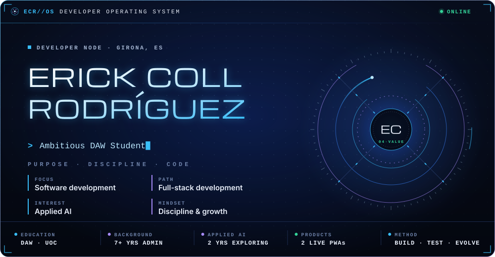
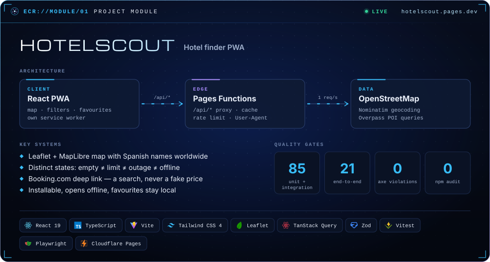
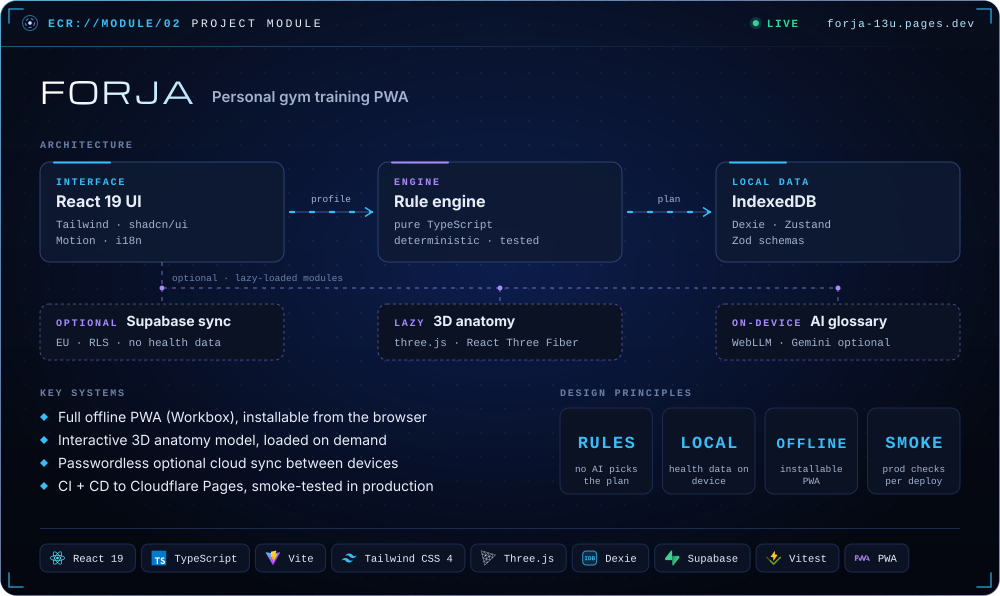
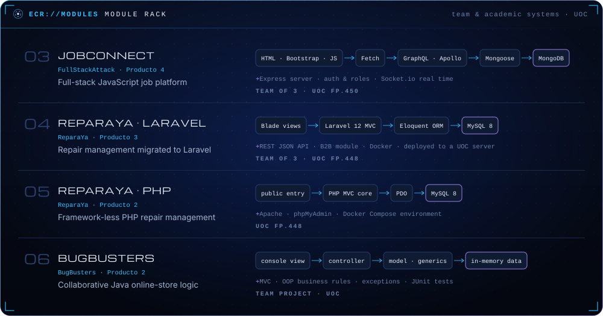
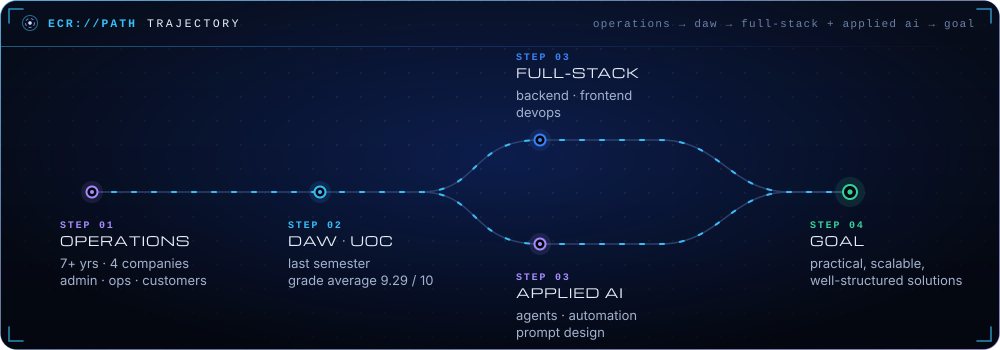
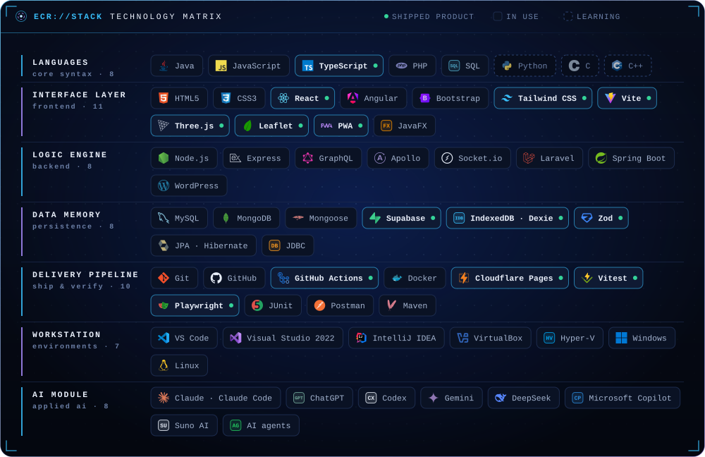
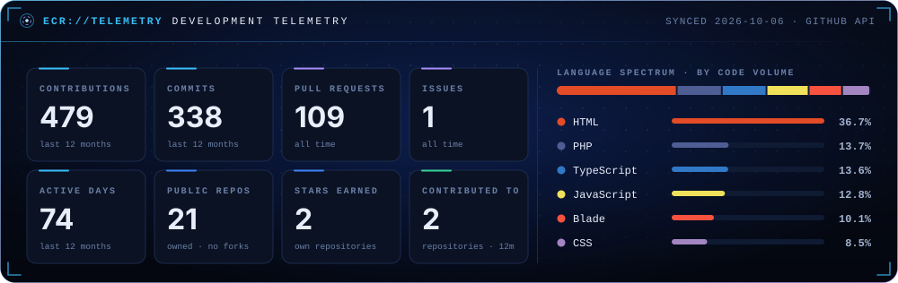
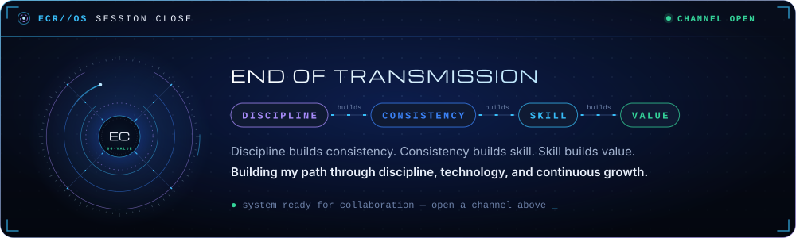

  
  
  

   
  <b>Full-stack developer in training, open to a DAW internship</b> 
  Last semester at UOC · grade average 9.29/10 · Girona, Catalunya 
  Disponible para las prácticas de DAW (formación en empresa)

  <a href="#01-projects">Projects</a> ·
  <a href="#02-now">Now</a> ·
  <a href="#03-about">About</a> ·
  <a href="#04-stack">Stack</a> ·
  <a href="#05-applied-ai">AI</a> ·
  <a href="#06-telemetry">Telemetry</a> ·
  <a href="#07-contact">Contact</a>

I build software the way I learned to run operations: with structure, ownership and an eye for the detail that breaks things. After **7+ years in administration, operations and customer service**, I'm in the **last semester of Web Application Development (DAW) at the UOC** and turning that discipline into full-stack products — **two of them live in production**, with automated tests behind them.

## `01` Projects

### [HotelScout](https://github.com/EricKColl/hotelscout) · hotel finder PWA

Progressive Web App that finds real accommodation near a station, an airport or an address using OpenStreetMap data, with an interactive map, filters, favourites and a Booking.com search link — no accounts, no trackers, €0 running cost.

 **[hotelscout.pages.dev →](https://hotelscout.pages.dev)** · [Source](https://github.com/EricKColl/hotelscout) · [CI](https://github.com/EricKColl/hotelscout/actions/workflows/ci.yml) 
85 unit/integration + 21 end-to-end tests (Vitest · Playwright) · 0 axe violations · 0 npm audit vulnerabilities · React · TypeScript · Vite · Tailwind CSS · Leaflet · Cloudflare Pages · PWA

### [Forja](https://github.com/EricKColl/LeriFitness) · personal gym training PWA

Local-first PWA for personalised gym training: workout plans generated by a deterministic, fully tested rule engine based on evidence-backed training principles — no AI decides your plan. Works offline, installs from the browser and keeps health data on your device, with an interactive 3D anatomy model and optional cloud sync.

 **[forja-13u.pages.dev →](https://forja-13u.pages.dev)** · [Source](https://github.com/EricKColl/LeriFitness) (repo: LeriFitness) · [CI](https://github.com/EricKColl/LeriFitness/actions/workflows/ci.yml) · [Production smoke tests](https://github.com/EricKColl/LeriFitness/actions/workflows/smoke.yml) 
Rule engine in pure TypeScript with tests · offline PWA (Workbox) · optional Supabase sync (EU, RLS, no health data) · React · TypeScript · Vite · Tailwind CSS · Three.js · IndexedDB (Dexie) · Supabase · Vitest · PWA

### Team product lines · UOC

- **[JobConnect · FullStackAttack Producto 4](https://github.com/EricKColl/FullStackAttack-Producto4)** — **Full-Stack JavaScript application** integrating frontend, GraphQL, MongoDB, Mongoose, Fetch and WebSockets — the most complete iteration of the JobConnect platform, with JWT auth, roles and Socket.io real time. JavaScript · Node.js · Express · GraphQL (Apollo) · MongoDB · Socket.io — team of 3
- **[ReparaYa](https://github.com/EricKColl/ReparaYa-Producto4-WordPress)** — repair-management system rebuilt three times: a **framework-less PHP** web app with MVC architecture, MySQL and Docker ([Producto 2](https://github.com/EricKColl/ReparaYa-Producto2)) → **migration to Laravel** with database integration and MVC architecture ([Producto 3](https://github.com/EricKColl/ReparaYa-Producto3-Laravel)) → **WordPress** ([Producto 4](https://github.com/EricKColl/ReparaYa-Producto4-WordPress)). PHP · Laravel · MVC · MySQL · Docker · WordPress — team of 3
- **[Online Store · BugBusters Producto 5](https://github.com/jenhmy/bugbusters_P5)** — Java desktop app with a JavaFX interface, JPA/Hibernate persistence on MySQL and a KPI dashboard. It grew from [BugBusters Producto 2](https://github.com/EricKColl/BugBusters-Producto2), a collaborative **Java project** focused on MVC architecture, generics, exceptions, JUnit testing, and console-based business logic. Java · JavaFX · JPA / Hibernate · MySQL · Maven · JUnit — team of 4

<b>Full project ecosystem — every iteration</b>

 

| Product line | Stack | Iterations |
|:--|:--|:--|
| **HotelScout** | React · TypeScript · Vite · Tailwind CSS · Leaflet · Cloudflare Pages · PWA | [Hotel finder PWA](https://github.com/EricKColl/hotelscout) · [Live demo](https://hotelscout.pages.dev) |
| **Forja** | React · TypeScript · Vite · Tailwind CSS · Three.js · Dexie · Supabase · PWA | [Personal gym training PWA](https://github.com/EricKColl/LeriFitness) · [Live demo](https://forja-13u.pages.dev) |
| **Portfolio** | Next.js · React · TypeScript · Tailwind CSS · WebGL · GitHub Pages | [Portfolio V2](https://github.com/EricKColl/Portfolio-V2) · [Live site](https://erickcoll.github.io/Portfolio-V2/) |
| **FullStackAttack — JobConnect** | HTML · CSS · Bootstrap · JS · GraphQL · MongoDB · WebSockets | [Producto 1](https://github.com/EricKColl/FullStackAttack-Project) → [Producto 2](https://github.com/EricKColl/FullStackAttack-Producto2-Individual-) → [Producto 3](https://github.com/EricKColl/FullStackAttack-Producto3) → [Producto 4](https://github.com/EricKColl/FullStackAttack-Producto4) |
| **ReparaYa** | PHP · MVC · MySQL · Docker · Laravel · WordPress | [Producto 2](https://github.com/EricKColl/ReparaYa-Producto2) → [Producto 3 (Laravel)](https://github.com/EricKColl/ReparaYa-Producto3-Laravel) → [Producto 4 (WordPress)](https://github.com/EricKColl/ReparaYa-Producto4-WordPress) |
| **BugBusters — Online Store** | Java · MVC · Generics · Exceptions · JUnit · JDBC · JPA / Hibernate · JavaFX | [Producto 1](https://github.com/EricKColl/BugBusters-Producto1) → [Producto 2](https://github.com/EricKColl/BugBusters-Producto2) → [Producto 4](https://github.com/EricKColl/BugBustersProducto4) → [Producto 5 (JavaFX)](https://github.com/jenhmy/bugbusters_P5) |
| **Trendtech** | HTML · CSS · JavaScript · Three.js | [Immersive tech-trends web portal](https://github.com/EricKColl/Trendtech) · [Live site](https://erickcoll.github.io/Trendtech/) |

## `02` Now

 **Internship phase (FP.406 · formación en empresa)** — the final DAW module, done in a company. Available for a placement.

 **[Equipo Basket](https://github.com/EricKColl/FP.451-Producto1)** — single-page app to manage a basketball team roster: searchable, filterable player list, detail view and video player. [Run it in StackBlitz →](https://stackblitz.com/github/EricKColl/FP.451-Producto1/tree/main) 
Angular · Bootstrap — role: technical coordination & integration in a team of 4

 **[Biblioteca](https://github.com/EricKColl/FP.449-Producto1)** — library web app for book loans, running on an application server. 
Java 21 · Spring Boot · Thymeleaf · Maven · Docker — team project

<b>Roadmap</b>

 

- [ ] Strengthen my **Java** and **backend development** foundations
- [ ] Build more complete and polished **full-stack projects**
- [ ] Improve my **GitHub portfolio**, code structure and project presentation
- [ ] Continue exploring **applied AI** in practical and productive workflows
- [ ] Grow as a disciplined developer with strong technical foundations

## `03` About

My training covers **programming**, **modern web technologies**, **backend and frontend development**, **databases**, **operating systems**, **virtualization**, **containerization** and real-world digital tools, built through hands-on projects with **Java**, **C++**, **PHP**, **WordPress**, **Laravel**, **Docker**, **VirtualBox** and **Hyper-V**. Main direction: **full-stack development**; extra focus: **applied AI**, AI agents, productivity workflows and prompt design. The goal: grow into a versatile developer who builds **useful, scalable and well-structured solutions**.

**Education** — Web Application Development (DAW, Spain's higher vocational degree in web development) at the **UOC** · last semester · grade average **9.29/10** · 18 modules passed 
**Languages** — Catalan and Spanish (native) · English (B1.1)

| Transferable experience | Focus | Years |
|:--|:--|:--|
| **Bisbal Vins** | Administration and processes | 3 |
| **Instal·lacions Cárdenas** | Operations coordination | 1.5 |
| **Can Condom** | Customer service | 2 |
| **Seguritec Costa Brava** | Administrative support | 1 |

<b>DAW modules and grades</b>

 

| Module | Grade |
|:--|:--|
| FP.402 · Sustainability applied to the production system | 9.9 |
| FP.438 · Setting up a company's operating system | 9.7 |
| FP.439 · Database design and programming | 9.7 |
| FP.044 · English B1.1 | 9.6 |
| FP.063 · Graphic design | 9.6 |
| FP.447 · Object-oriented programming with database access | 9.6 |
| FP.437 · Digital skills in vocational training | 9.6 |
| FP.448 · Back-end development with PHP, MVC frameworks and content management | 9.5 |
| FP.450 · Full-stack JavaScript web solutions and web services | 9.4 |
| FP.038 · Programming fundamentals | 9.0 |
| FP.055 · Introduction to databases | 8.9 |
| FP.446 · Object-oriented programming | 8.9 |
| FP.440 · Custom commands for the system | 8.8 |
| FP.054 · Operating system configuration | 8.7 |
| FP.415 · Digitalisation applied to production sectors | 8.2 |
| FP.417 · Employability itinerary I-A: job-search tools | Recognised |
| FP.418 · Employability itinerary I-B: occupational risk prevention | Recognised |
| FP.419 · Employability itinerary II: business and entrepreneurship | Recognised |
| FP.406 · Work-based training phase (internship) | In progress |
| FP.449 · Back-end applications with Java on application servers | In progress |
| FP.451 · Front-end development with advanced frameworks for mobile | In progress |

<b>Trajectory and operating principles</b>

 

**Operating principles** — structured & disciplined work ethic · strong sense of responsibility · problem-solving mindset · attention to detail · organization & consistency · adaptability & continuous learning.

## `04` Stack

Highlighted chips run in production inside **HotelScout** and **Forja**; the rest are in active use or being learned through DAW coursework and team projects.

<b>Text version of the matrix</b>

 

| Layer | Technologies (● live in production) |
|:--|:--|
| **Languages** | Java · JavaScript · TypeScript ● · PHP · Python · C · C++ · SQL |
| **Interface** | HTML5 · CSS3 · React ● · Angular · Bootstrap · Tailwind CSS ● · Vite ● · Three.js ● · Leaflet ● · PWA ● · JavaFX |
| **Logic engine** | Node.js · Express · GraphQL · Apollo · Socket.io · Laravel · Spring Boot · WordPress |
| **Data** | MySQL · MongoDB · Mongoose · Supabase ● · IndexedDB (Dexie) ● · Zod ● · JPA / Hibernate · JDBC |
| **Delivery pipeline** | Git · GitHub · GitHub Actions ● · Docker · Cloudflare Pages ● · Vitest ● · Playwright ● · JUnit · Postman · Maven |
| **Workstation** | VS Code · Visual Studio 2022 · IntelliJ IDEA · VirtualBox · Hyper-V · Windows · Linux |
| **AI tools** | Claude · Claude Code · ChatGPT · OpenAI · Codex · DeepSeek · Microsoft Copilot · Google Gemini · Suno AI · AI agents |

## `05` Applied AI

AI is part of my workflow, not a substitute for engineering judgement. In **Forja** the training plan comes from a deterministic, tested rule engine by design; AI stays at the edges, with an on-device glossary (WebLLM) and Gemini as an optional assistant. Day to day I use Claude, ChatGPT, Codex, DeepSeek, Gemini and Copilot for coding support, research, prompt design and automation, and Suno AI and other media tools for creative work.

<b>AI areas and workflows</b>

 

| Area | Focus |
|:--|:--|
| **Applied AI** | Coding support, structured workflows, and productivity |
| **AI assistants** | Claude, ChatGPT, Codex, DeepSeek, Gemini, and Copilot in learning and development processes |
| **AI agents** | Practical experimentation for automation, task support, reasoning workflows, and process optimization |
| **Media tools** | AI tools for photo editing, video editing, file and document processing |
| **Creative workflows** | AI-assisted music, content creation, and digital media workflows, including tools such as Suno AI |
| **Continuous exploration** | Automation, prompt design, and practical AI integration |

## `06` Telemetry

Rendered every day by a [GitHub Action](.github/workflows/profile-cards.yml) straight from the GitHub API — no third-party stats services, no trackers.

## `07` Contact

**[erickcollrodriguez@gmail.com](mailto:erickcollrodriguez@gmail.com)** · [Portfolio V2](https://erickcoll.github.io/Portfolio-V2/) · [CV (PDF, Spanish)](cv/Erick-Coll-Rodriguez-CV-ES.pdf) · Girona, Catalunya

