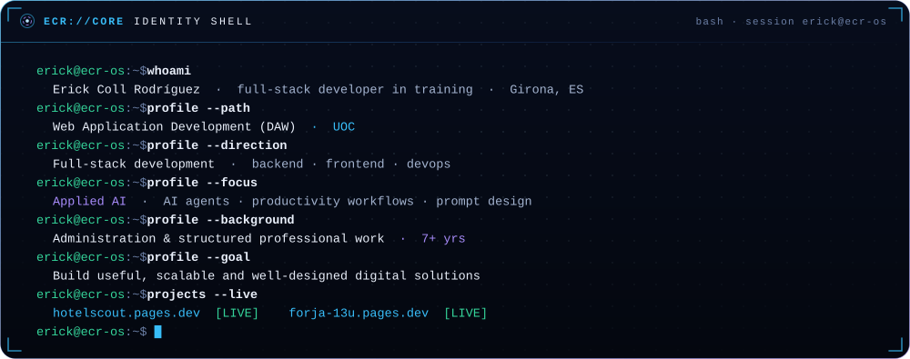
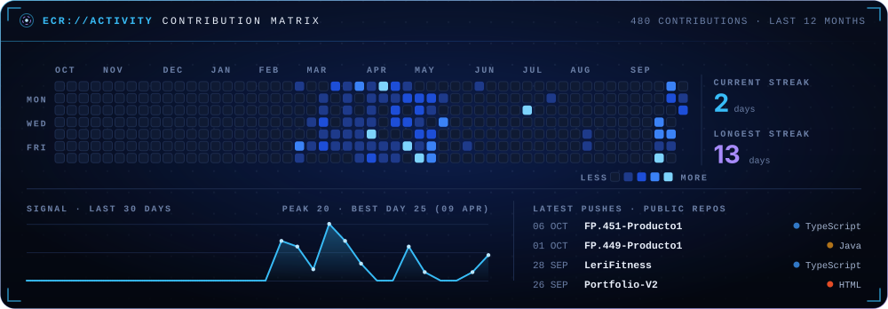

  
  

<b>Full-Stack Developer in training</b> · DAW student at UOC · Applied AI · Girona, Spain

  <a href="#01-identity-core">Core</a> ·
  <a href="#02-technology-matrix">Stack</a> ·
  <a href="#03-project-modules">Modules</a> ·
  <a href="#04-ai-subsystem">AI</a> ·
  <a href="#05-current-operations">Operations</a> ·
  <a href="#06-telemetry">Telemetry</a> ·
  <a href="#07-open-channel">Contact</a>

## `01` Identity Core

I build software the way I learned to run operations: with structure, ownership and an eye for the detail that breaks things. After **more than seven years in administration**, I'm studying **Web Application Development (DAW)** at the **UOC** and turning that discipline into full-stack products — two of them already **live in production**.

My training covers **programming**, **modern web technologies**, **backend and frontend development**, **databases**, **operating systems**, **virtualization**, **containerization** and real-world digital tools, built through hands-on projects with **Java**, **C++**, **PHP**, **WordPress**, **Laravel**, **Docker**, **VirtualBox** and **Hyper-V**. In parallel I put **applied AI** to work in technical and creative environments — coding support, research, prompt design, automation, content generation and digital productivity. The goal: grow into a versatile developer who ships **practical, scalable and well-structured solutions**.

**Operating principles** — structured & disciplined work ethic · strong sense of responsibility · problem-solving mindset · attention to detail · organization & consistency · adaptability & continuous learning.

## `02` Technology Matrix

Seven layers, from syntax to delivery. Highlighted chips run in production inside **HotelScout** and **Forja**; the rest are in active use or being learned through DAW coursework and team projects.

<b>Text version of the matrix</b>

 

| Layer | Technologies |
|:--|:--|
| **Languages** | Java · JavaScript · TypeScript · PHP · Python · C · C++ · SQL |
| **Interface** | HTML5 · CSS3 · React · Angular · Bootstrap · Tailwind CSS · Vite · Three.js · Leaflet · PWA · JavaFX |
| **Logic engine** | Node.js · Express · GraphQL · Apollo · Socket.io · Laravel · Spring Boot · WordPress |
| **Data memory** | MySQL · MongoDB · Mongoose · Supabase · IndexedDB (Dexie) · Zod · JPA / Hibernate · JDBC |
| **Delivery pipeline** | Git · GitHub · GitHub Actions · Docker · Cloudflare Pages · Vitest · Playwright · JUnit · Postman · Maven |
| **Workstation** | VS Code · Visual Studio 2022 · IntelliJ IDEA · VirtualBox · Hyper-V · Windows · Linux |
| **AI module** | Claude · ChatGPT · OpenAI · Codex · DeepSeek · Microsoft Copilot · Google Gemini · Suno AI · AI agents |

## `03` Project Modules

Two products in production, and the team systems that taught me how to build them — each product line grown version after version.

**[HotelScout](https://github.com/EricKColl/hotelscout)** — Progressive Web App that finds real accommodation near a station, an airport or an address using OpenStreetMap data, with an interactive map, filters, favourites and a Booking.com search link — no accounts, no trackers, €0 running cost. 
React · TypeScript · Vite · Tailwind CSS · Leaflet · Cloudflare Pages · PWA &nbsp;  **[hotelscout.pages.dev →](https://hotelscout.pages.dev)**

**[Forja](https://github.com/EricKColl/LeriFitness)** — Local-first PWA for personalised gym training: workout plans generated by a deterministic, fully tested rule engine based on evidence-backed training principles — no AI decides your plan. Works offline, installs from the browser and keeps health data on your device, with an interactive 3D anatomy model and optional cloud sync. 
React · TypeScript · Vite · Tailwind CSS · Three.js · IndexedDB (Dexie) · Supabase · Vitest · PWA &nbsp;  **[forja-13u.pages.dev →](https://forja-13u.pages.dev)**

- **[FullStackAttack · Producto 4](https://github.com/EricKColl/FullStackAttack-Producto4)** — **Full-Stack JavaScript application** integrating frontend, GraphQL, MongoDB, Mongoose, Fetch and WebSockets — the most complete iteration of the JobConnect platform. JavaScript · GraphQL · MongoDB · WebSockets
- **[ReparaYa · Laravel](https://github.com/EricKColl/ReparaYa-Producto3-Laravel)** — **Migration of the ReparaYa repair-management system to Laravel**, with database integration and MVC architecture. PHP · Laravel · MVC · MySQL
- **[ReparaYa · PHP + Docker](https://github.com/EricKColl/ReparaYa-Producto2)** — **Repair-management web application** built in framework-less PHP, with MVC architecture, MySQL and Docker. PHP · MySQL · Docker
- **[BugBusters · Producto 2](https://github.com/EricKColl/BugBusters-Producto2)** — Collaborative **Java project** focused on MVC architecture, generics, exceptions, JUnit testing, and console-based business logic. Java · MVC · JUnit

<b>Full project ecosystem — every product line, built step by step</b>

 

| Product line | Stack | Iterations |
|:--|:--|:--|
| **HotelScout** | React · TypeScript · Vite · Tailwind CSS · Leaflet · Cloudflare Pages · PWA | [Hotel finder PWA](https://github.com/EricKColl/hotelscout) · [Live demo](https://hotelscout.pages.dev) |
| **Forja** | React · TypeScript · Vite · Tailwind CSS · Three.js · Dexie · Supabase · PWA | [Personal gym training PWA](https://github.com/EricKColl/LeriFitness) · [Live demo](https://forja-13u.pages.dev) |
| **FullStackAttack — JobConnect** | HTML · CSS · Bootstrap · JS · GraphQL · MongoDB · WebSockets | [Producto 1](https://github.com/EricKColl/FullStackAttack-Project) → [Producto 2](https://github.com/EricKColl/FullStackAttack-Producto2-Individual-) → [Producto 3](https://github.com/EricKColl/FullStackAttack-Producto3) → [Producto 4](https://github.com/EricKColl/FullStackAttack-Producto4) |
| **ReparaYa** | PHP · MVC · MySQL · Docker · Laravel · WordPress | [Producto 2](https://github.com/EricKColl/ReparaYa-Producto2) → [Producto 3 (Laravel)](https://github.com/EricKColl/ReparaYa-Producto3-Laravel) → [Producto 4 (WordPress)](https://github.com/EricKColl/ReparaYa-Producto4-WordPress) |
| **BugBusters — Online Store** | Java · MVC · Generics · Exceptions · JUnit · JDBC · JPA / Hibernate · JavaFX | [Producto 1](https://github.com/EricKColl/BugBusters-Producto1) → [Producto 2](https://github.com/EricKColl/BugBusters-Producto2) → [Producto 4](https://github.com/EricKColl/BugBustersProducto4) → [Producto 5 (JavaFX)](https://github.com/jenhmy/bugbusters_P5) |
| **Trendtech** | HTML · CSS · JavaScript · Three.js | [Immersive tech-trends web portal](https://github.com/EricKColl/Trendtech) · [Live site](https://erickcoll.github.io/Trendtech/) |

## `04` AI Subsystem

AI is part of the workflow, not a substitute for engineering judgement — Forja's training plans, for example, come from a tested rule engine, by design.

| Area | Focus |
|:--|:--|
| **Applied AI** | Coding support, structured workflows, and productivity |
| **AI assistants** | Claude, ChatGPT, Codex, DeepSeek, Gemini, and Copilot in learning and development processes |
| **AI agents** | Practical experimentation for automation, task support, reasoning workflows, and process optimization |
| **Media tools** | AI tools for photo editing, video editing, file and document processing |
| **Creative workflows** | AI-assisted music, content creation, and digital media workflows, including tools such as Suno AI |
| **Continuous exploration** | Automation, prompt design, and practical AI integration |

<b>Toolchain</b> — Claude · Claude Code · ChatGPT · OpenAI · Codex · DeepSeek · Microsoft Copilot · Google Gemini · Suno AI · AI agents

## `05` Current Operations

 **[Equipo Basket](https://github.com/EricKColl/FP.451-Producto1)** — single-page app to manage a basketball team roster: searchable, filterable player list, detail view and video player. [Run it in StackBlitz →](https://stackblitz.com/github/EricKColl/FP.451-Producto1/tree/main) 
Angular · Bootstrap — role: technical coordination & integration in a team of 4

 **[Biblioteca](https://github.com/EricKColl/FP.449-Producto1)** — library web app for book loans, running on an application server. 
Java 21 · Spring Boot · Thymeleaf · Maven · Docker — team project

**Roadmap**

- [ ] Strengthen my **Java** and **backend development** foundations
- [ ] Build more complete and polished **full-stack projects**
- [ ] Improve my **GitHub portfolio**, code structure and project presentation
- [ ] Continue exploring **applied AI** in practical and productive workflows
- [ ] Grow as a disciplined developer with strong technical foundations

## `06` Telemetry

Rendered every day by a [GitHub Action](.github/workflows/profile-cards.yml) straight from the GitHub API — no third-party stats services, no trackers.

## `07` Open Channel

| Channel | Address |
|:--|:--|
| **Email** | [erickcollrodriguez@gmail.com](mailto:erickcollrodriguez@gmail.com) |
| **Portfolio** | [erickcoll.github.io/Portfolio-V2](https://erickcoll.github.io/Portfolio-V2/) |
| **Location** | Girona, Spain |

